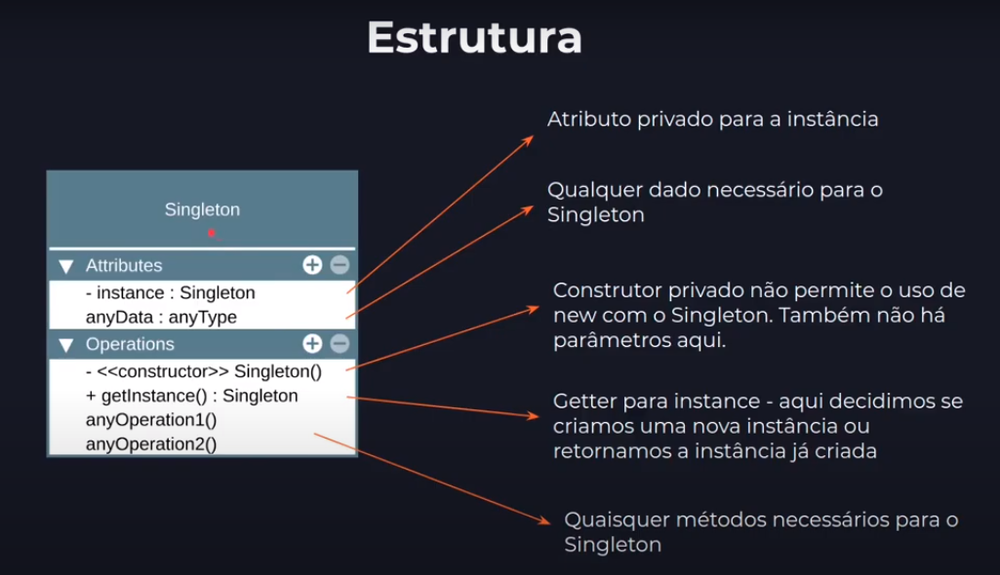

# Singleton

**Intenção:** Garantir que uma classe tenha somente uma instancia no programa e fornecer um ponto de acesso global para a mesma.

* Geralmete usado para acesso a *recurso compartilhados*, com acesso a base de dados, interfaces graficas, sistema de arquivo, servidores de impresão, logger e mais.

* Permitir acesso global ao singleton em toda sua aplicação, assim como faziamos (ou fazemos) com variáveis globais

* **Vantagem:** 
    
    - Singletom protege a instancia com encapsulamento, evitando que outro codigo sobrescreva seu valor.
    - Acesso controlado a instancia única
    - É fácil permitir um uso maior de  instancias caso mude de ideia
    - *Lazy Instantiation*, o singleton so é criado no momento do uso
    - Substitui variáveis globais

* **Desnvantagens:**
    
    - É mais diificil de testar
    - Viola o princípio da resposabilidade única (SOLID)
    - Requer tratamento especial em casos de concorrência
    0 Erich Gamma (autor) descreve que este seria o único padrão que ele removeria se fosse refatorar o livro.

* **Aplicabilidade:** 

    - Use o singleton quando uma classe precisar ter somente uma instancia disponivel em todo o seu programa
    - Use quando perceber que está usando variável globais para maneter partes importantes do programa, como variáveis de configuração que são usadas por toda a aplicação