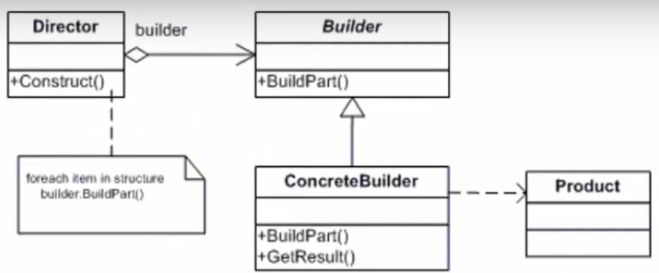

# Builder

|Buider|Separar|
|----------|----------|
|**O que** | A construção|
|**Do que** | de um objeto complexo|
|**De quem** | da sua representação|
|**Do que** | de modo que o processo de construção possa criar diferentes represetações|

Separar o código que cria e o código que usa o objeto

* **Objeto complexo**: Contrutor muito grande ou composto de vários objetos

## Contexto

* Pode produzir diferetes tipos e representações de um objeto usando o mesmo código de contrução.
* Constrói um objeto complexo usando muitos objetos simples em uma abordagem passo a passo(etapas).
* Permite realizar o encadeamento de chamadas de métodos (method chaining)

## Vantagens
* Permite esconder os detalhes e como os objetos são criados
* Permite uma grande variedade de representações internas do objeto a ser construido
* Fornece um grande controle sobre o processo de criação de objetos complexos
* Cada Builder é independente dos outros builders e do restante da aplicação
* O principio da Responsabilidade única (SRP) é aplicado, uma vez que a construção complexa do objeto é isolada da lógica de negócio deste objeto. 

## Desvantagens

* Número de linhas aumenta conforme a complexidade do objeto e os tipos de objetos que vamos construir podendo haver duplicação de partes de código
* requer a criação de um ConcreteBuilder separado para cada tipo diferente de produto

## Quando usar?

* Quando a instancia de um objeto exige muitos parâmetros no construtor
* Vamos desejar criar um conjunto de objetos relacionados ou dependentes que podem ser usados juntos
* O sistema precisa ser independente de como seus produtos são criados, compostos ou representados
* Quando você deseja esconder os  detalhes do processo de contrução complexo.