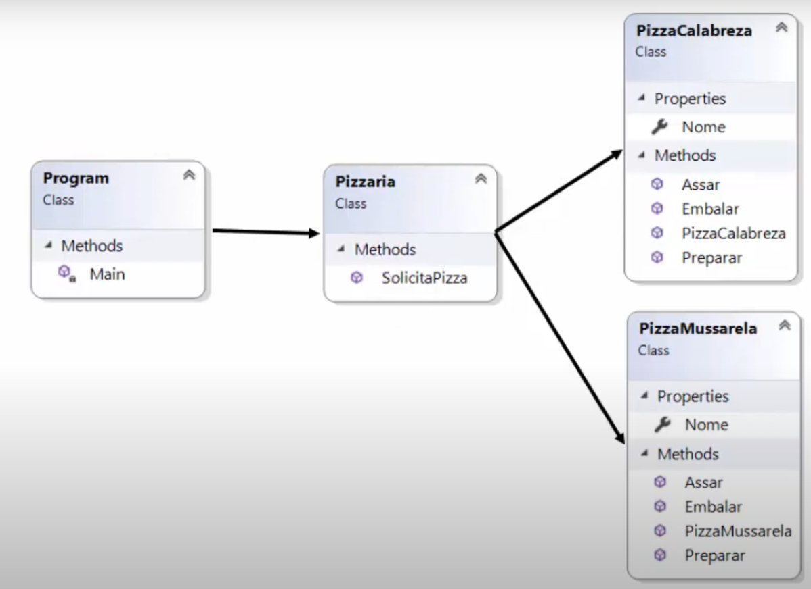
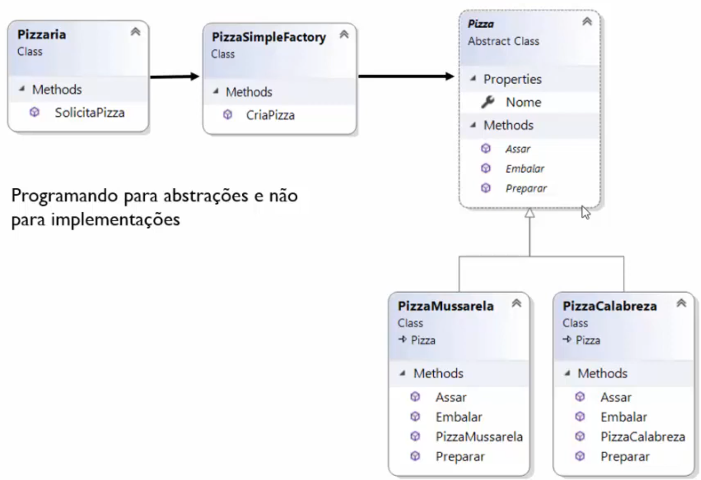

# Creational Patterns

Abstarem e/ou adiam o processo de **criação dos objetos**, e fornecem mecanismos de criação de objetos que aumentam a flexibilidade e reutilização do código existente.

## Factory
Um Factory é um objeto utilizado para criar outros objetos.

* Criamos um objeto sem expor a lógica de criação do cliente.

### Simple Factory
É um objeto que é utilizado para criar instancias de um objeto para o cliente.

#### Exemplo:
* Sem simple factory

* Com simple factory

### Gof - Factory Method
### Gof - Abstract Factory

[back](../Readme.md)